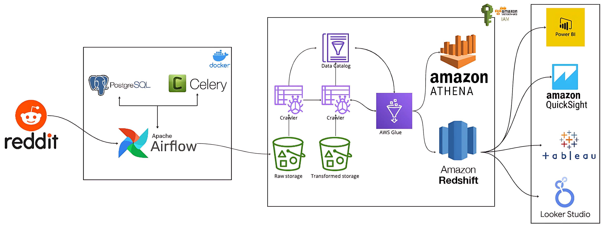

# Orchestration of ETL Pipeline from Reddit API to Amazon Redshift with Apache Airflow.

This project implements an end-to-end data pipeline solution to ingest Reddit data into a Redshift Data Warehouse. The pipeline utilizes Apache Airflow to orchestrate various services and steps, including extracting Reddit API data, transforming the data, loading it into S3 buckets, cataloging it via AWS Glue, exposing it in Athena for analysis, and ultimately loading the aggregated, analysis-ready datasets into Redshift. Key technologies leveraged include Airflow, PostgreSQL, S3, Glue, Athena, and Redshift. Together, they provide a robust and scalable infrastructure for acquiring, preparing, querying, and storing Reddit data.

## Table of Contents

- [Overview](#overview)
- [System Design Architecture](#system-design-architecture)
- [Prerequisites](#prerequisites)
- [Manual Steps to Run the Application](#manual-steps-to-run-the-application)
- [YouTube Tutorial](https://www.youtube.com/watch?v=LSlt6iVI_9Y)

## Overview

The ETL pipeline is designed to:

1. Extract data from Reddit using its API.
2. Setup and orchestrate ETL pipeline with Apache Airflow.
3. Store the raw data efficiently in a S3 bucket from Airflow.
4. Leverage AWS Glue for data cataloging and ETL jobs.
5. Query and transform data with Amazon Athena.
6. Setup the Redshift Cluster to load the transformed data into the Amazon Redshift for analytics.

## System Design Architecture



1. **Reddit API**: Data Source.
2. **Apache Airflow**: Apache Airflow is an open-source workflow management platform that programmatically author, schedule, and monitor workflows.
3. **PostgreSQL**: Provide temporary metadata storage for Apache Airflow. The metadata database is a core component of Airflow. It stores crucial information, such as the configuration of the Airflow environment's roles and permissions, along with all metadata for past and present DAGs and task runs.
4. **Amazon S3**: AWS S3 is an object storage service offering industry-leading scalability, data availability, security, and performance. We can store, organize, and protect data for virtually any use case, such as data lakes, cloud-native applications, and mobile apps.
5. **AWS Glue**: AWS Glue is a fully managed ETL service that handles the entire ETL workflow, allowing users to focus on analytics and getting business insights rather than writing complex ETL scripts and jobs. Glue provides integrated data crawlers that automatically crawl data sources to populate metadata in the AWS Glue Data Catalog. Glue works seamlessly across many AWS analytics services like Athena, Redshift, EMR, Quicksight, etc.
6. **Amazon Athena**: Amazon Athena is an interactive query service provided by AWS that allows users to analyze data directly in Amazon S3 using standard SQL without any infrastructure to manage. It analyzes all kinds of datasets to derive actionable insights using standard SQL.
7. **Amazon Redshift**: Amazon Redshift is a fast, scalable, secure, and fully managed cloud data warehousing service within AWS for building petabyte-scale data warehouses. It uses a massively parallel processing (MPP) architecture to provide fast query performance on large datasets. Redshift integrates with many AWS services like S3, EMR, Athena, etc., and various BI and visualization tools.

## Prerequisites

- Python 3.10 or higher.
- Reddit API credentials.
- Docker Installation.
- AWS Account with appropriate permission for S3, Glue, Athena, and Redshift.

## Manual Steps to Run the Application

#### Step 1: Create a Virtual Environment and Install Dependency.

```bash
# Clone the Repository.
git clone https://github.com/gangulyaritra/reddit-etl-pipeline.git

# Create a Virtual Environment.
python3 -m venv venv

# Activate the Virtual Environment.
source venv/bin/activate

# Install the Dependencies.
pip install -r requirements.txt
```

#### Step 2: Install the latest version of the [AWS CLI](https://docs.aws.amazon.com/cli/latest/userguide/getting-started-install.html).

```bash
curl "https://awscli.amazonaws.com/awscli-exe-linux-x86_64.zip" -o "awscliv2.zip"
unzip awscliv2.zip
sudo ./aws/install
```

#### Step 3: Export the Environment Variables.

```bash
=========================================================================
Paste the following credentials as environment variables.
=========================================================================

export AWS_ACCESS_KEY_ID="<AWS_ACCESS_KEY_ID>"
export AWS_SECRET_ACCESS_KEY="<AWS_SECRET_ACCESS_KEY>"
```

#### Step 4: Start the Docker Containers.

```bash
# Initialize the Airflow Database.
docker-compose up airflow-init

# Clean up the environment.
docker-compose down --volumes --remove-orphans

# Running Airflow inside Docker.
docker-compose up
```

#### Step 5: Launch the Airflow UI.

```bash
http://localhost:8080
```

- The default account has the login **airflow** and the password **airflow**.

- Create an Airflow Variable "**subreddit**" and enter the value.

## Authors

- [Aritra Ganguly](https://in.linkedin.com/in/gangulyaritra)

## License & Copyright

[MIT License](LICENSE)
